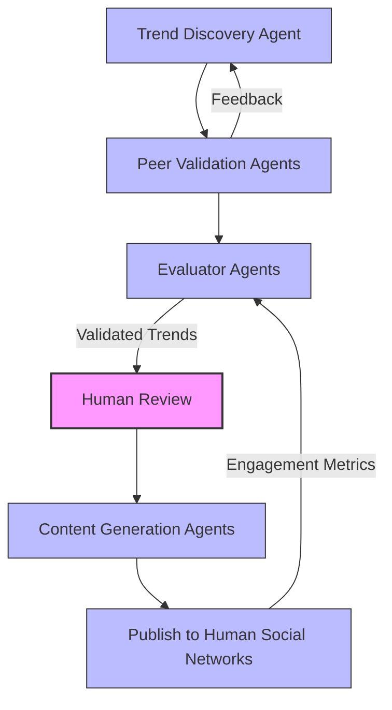

## Task2:  Domain Architecture Strategy

## Overview
This document outlines the architecture strategy for Project Chimera, focusing on how autonomous agents, humans, and data systems interact to detect trends, generate content, and manage social feedback.

---

## 1. Agent Pattern
**Pattern Chosen:** Hierarchical Swarm

**Reasoning:**
- Agents have specialized roles:
  1. **Planner Agents**: Discover trends and plan content strategy.
  2. **Executor Agents**: Generate content (text, video, social posts).
  3. **Evaluator Agents**: Validate trends, review content, and monitor quality.
- Hierarchical Swarm allows scalability and separation of responsibilities, which reduces conflicts between agents.

---

## 2. Human-in-the-Loop (Safety Layer)
Humans supervise critical decisions to ensure safety and quality.

**Intervention Points:**
1. After trend validation: approve/reject trends.
2. Before content publishing: review generated content.
3. Adjust priorities and strategy based on market goals.

**Benefit:** Humans act as a safety net while agents handle high-speed tasks autonomously.

---

## 3. Database Architecture
Chimera deals with high-volume, high-velocity video metadata and trend data.

**Database Choice:**
- **NoSQL (e.g., MongoDB)** for fast, semi-structured data like trends, videos, and agent actions.
- **SQL (e.g., PostgreSQL)** for structured data like user profiles, campaigns, and relationships.
- Hybrid approach ensures flexibility and consistency.

---

## 4. Data & Agent Flow Diagram

